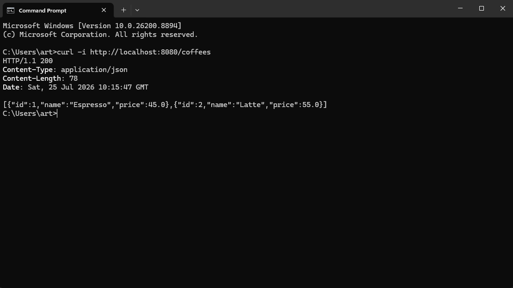
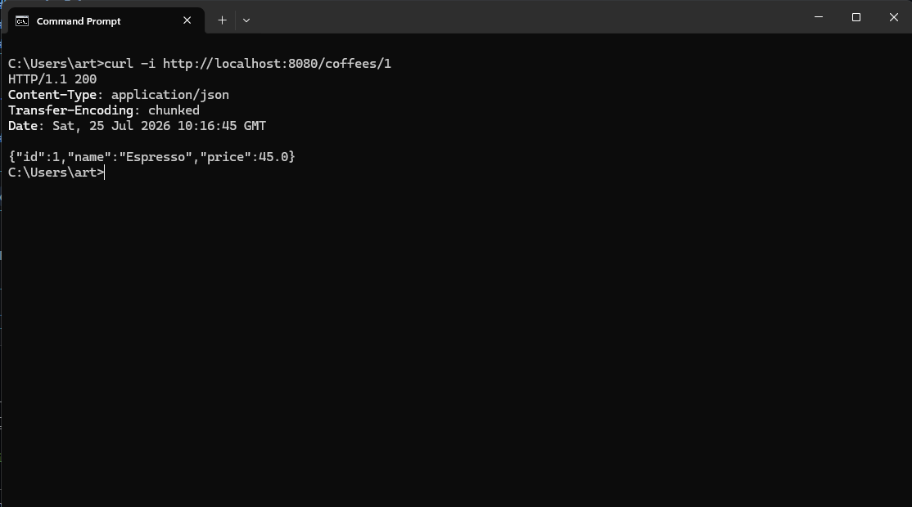
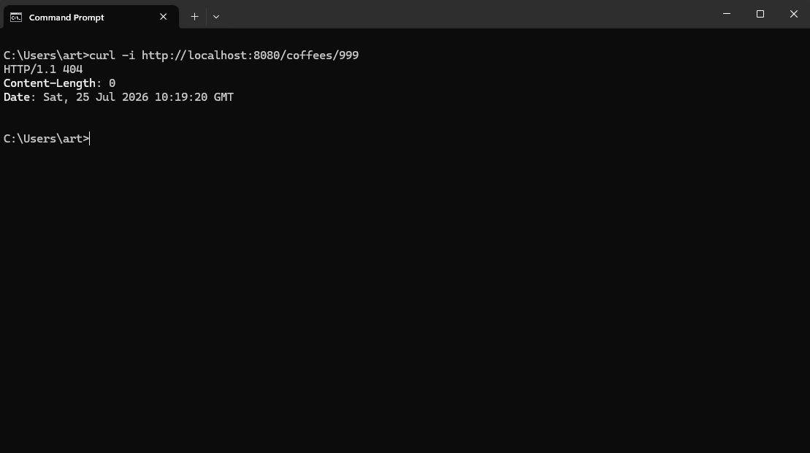
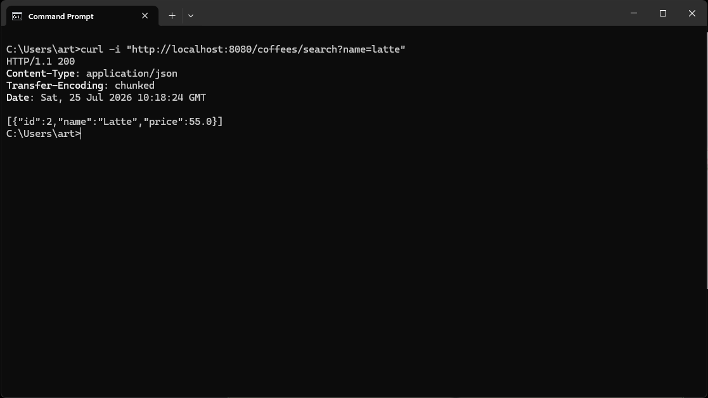
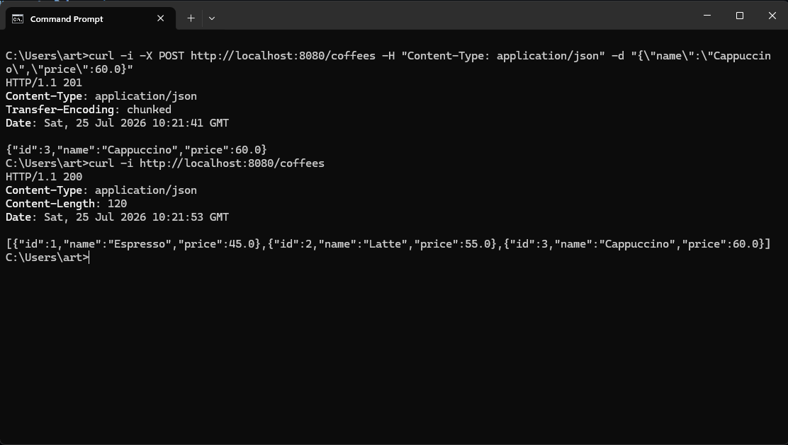
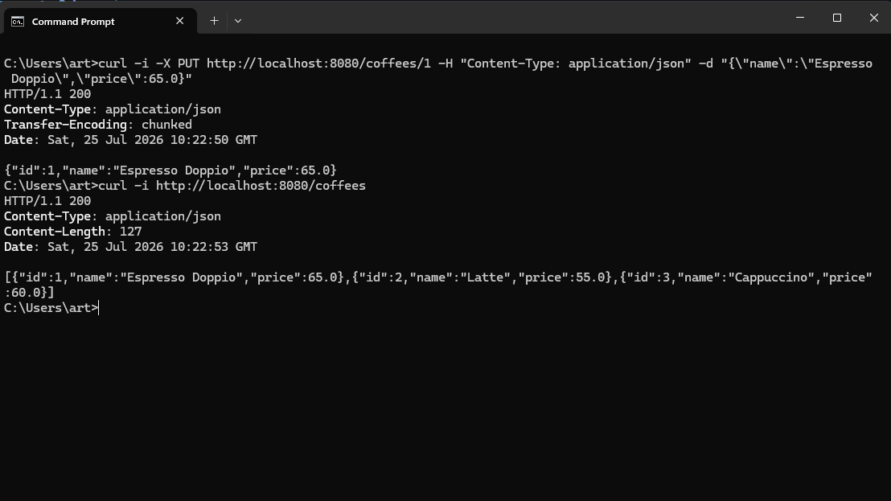
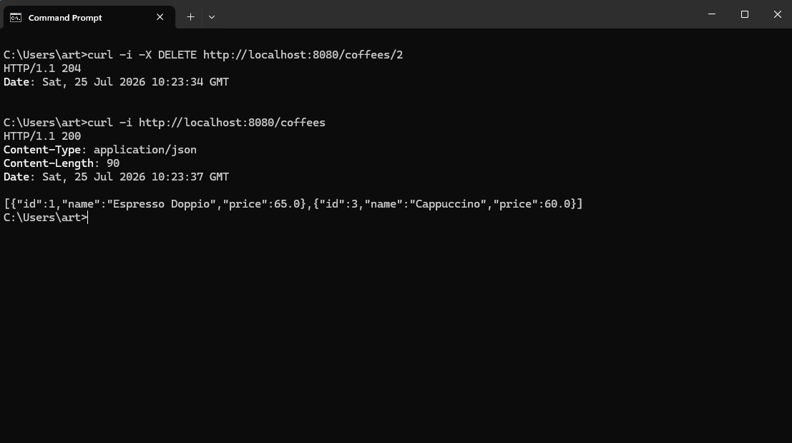

# Coffee API — Spring Boot Demo (Lab)

REST API ง่าย ๆ สำหรับจัดการรายการกาแฟ (CRUD + ค้นหาตามชื่อ) เขียนด้วย Spring Boot
ข้อมูลเก็บอยู่ใน memory (`ArrayList`) เท่านั้น — ข้อมูลจะหายทุกครั้งที่ restart แอป

---

# คำตอบคำถาม Lab

## 1. HTTP method แต่ละตัว (GET/POST/PUT/DELETE) ต่างกันอย่างไร ยกตัวอย่างจากโปรเจกต์ตัวเอง

**Answer:**

GET ใช้ในการดึงข้อมูล เช่น `GET /coffees` หรือ `GET /coffees/search?name=latte`

POST ใช้สร้างข้อมูลใหม่ เช่น `POST http://localhost:8080/coffees -H "Content-Type: application/json" -d '{\"name\":\"Mocha\",\"price\":65}` สร้างกาแฟใหม่ (มอคค่า)

PUT ใช้แก้ไขข้อมูลที่มีอยู่ทั้งก้อน เช่น `PUT -d '{\"name\":\"Latte\",\"price\":50.0}'`

DELETE ใช้ลบข้อมูล เช่น `DELETE /coffees/4`

## 2. ทำไมต้องแยก Controller กับ Service ออกจากกัน มีข้อดีอย่างไรถ้าโปรแกรมโตขึ้น

**Answer:**

เพราะ Controller มีหน้าที่รับ request หรือ response ส่วน Service เก็บ business logic เช่น การค้นหา, เพิ่ม, ลบข้อมูล แยกกันทำให้แต่ละส่วนมีหน้าที่ชัดเจน ถ้าโปรแกรมโตขึ้น เช่น เปลี่ยนจาก REST API เป็น GraphQL ก็ใช้ Service เดิมได้โดยไม่ต้องเขียน logic ซ้ำ ทำให้ประหยัดเวลาได้มากกว่า

## 3. ข้อมูลที่เก็บไว้ใน List ใน memory หายไปตอนไหน และถ้าอยากให้ไม่หายควรทำอย่างไร (ตอบเป็นแนวคิดพอ)

**Answer:**

ข้อมูลจะหายทันทีที่แอป restart หรือ process ถูกปิด เพราะเก็บอยู่ใน RAM ไม่ได้เขียนลง disk ถ้าอยากให้ข้อมูลไม่หาย ต้องเปลี่ยนไปเก็บใน database จริง เช่น MySQL หรือ PostgreSQL เป็นต้น

## 4. @RestController, @GetMapping, @PostMapping, @PathVariable, @RequestBody แต่ละตัวทำหน้าที่อะไร

**Answer:**

`@RestController` มีหน้าที่บอก Spring ว่า Class นี้จัดการ HTTP request และแต่ละ Method จะ return ให้แปลงเป็น JSON กลับไปหา Client ทันที

`@GetMapping` / `@PostMapping` จะบอก Spring ว่า method นี้ผูกกับ HTTP method อะไร และ path อะไร เช่น `@GetMapping("/search")` หมายถึงถ้ามี GET request มาที่ `/coffees/search` ให้เรียก method นี้

`@PathVariable` ใช้ดึงค่าจากส่วนหนึ่งของ URL path มาใส่ในตัวแปร เช่น `@GetMapping("/{id}")` กับ `@PathVariable Long id` ถ้ายิง `GET /coffees/2` ตัวแปร `id` จะมีค่า 2 โดยอัตโนมัติ ชื่อตัวแปรใน `{}` ต้องตรงกับชื่อ parameter เท่านั้น

`@RequestParam` ใช้ดึงค่าจาก query string (ส่วนหลัง `?`) เช่น `@GetMapping("/search")` กับ `@RequestParam String name` ถ้ายิง `GET /coffees/search?name=latte` ตัวแปร `name` จะได้ `"latte"` มา ต่างจาก `@PathVariable` ตรงที่อันนี้ไม่ใช่ส่วนหนึ่งของ path หลัก แต่เป็น optional parameter ต่อท้าย

`@RequestBody` ใช้แปลง JSON ที่ client ส่งมาใน body ของ request ให้กลายเป็น Java object โดยอัตโนมัติ เช่น ตอน `POST /coffees` ที่ body เป็น `{"name":"Mocha","price":65}` Spring จะแปลงเป็น `Coffee` object ให้เลยโดยไม่ต้อง parse JSON เอง

---

# เอกสารโปรเจกต์

> คำสั่งทั้งหมดในเอกสารนี้รันบน **Windows (Command Prompt / cmd.exe)** ได้เลย
> `curl.exe` มีติดมากับ Windows 10 (1803) ขึ้นไปอยู่แล้ว ไม่ต้องติดตั้งเพิ่ม

## Tech Stack

| รายการ | เวอร์ชัน |
| --- | --- |
| Java | 26 |
| Spring Boot | 4.1.0 |
| Build tool | Maven (มี Maven Wrapper ให้แล้ว) |
| Starter | `spring-boot-starter-webmvc` |

## โครงสร้างโปรเจกต์

```
Spring/
├── README.md
├── Screenshots/                <- ภาพผลการทดสอบแต่ละ endpoint
└── demo/                       <- Maven project root (pom.xml อยู่ที่นี่)
    ├── mvnw / mvnw.cmd
    ├── pom.xml
    └── src/
        ├── main/java/com/example/demo/
        │   ├── DemoApplication.java
        │   ├── controller/CoffeeAPIController.java
        │   ├── model/Coffee.java
        │   └── service/CoffeeService.java
        └── test/java/com/example/demo/
            └── DemoApplicationTests.java
```

## วิธีรันโปรเจกต์ (Maven)

### สิ่งที่ต้องมีก่อน

- **JDK 26** (โปรเจกต์ตั้ง `java.version` เป็น 26 ใน `pom.xml`)
- ไม่ต้องติดตั้ง Maven เอง — ใช้ Maven Wrapper (`mvnw.cmd`) ที่มากับโปรเจกต์ได้เลย

เช็กเวอร์ชัน Java:

```cmd
java -version
echo %JAVA_HOME%
```

> คำสั่งทั้งหมดต้องรันจากโฟลเดอร์ `demo/` เพราะ `pom.xml` อยู่ที่นั่น

```cmd
cd demo
```

### 1. รันแอป (โหมด development)

```cmd
mvnw.cmd spring-boot:run
```

ถ้าติดตั้ง Maven ไว้ในเครื่องอยู่แล้วก็ใช้ `mvn spring-boot:run` ได้เช่นกัน

แอปจะรันที่ **http://localhost:8080** — กด `Ctrl+C` เพื่อหยุด

### 2. Build เป็น JAR แล้วรัน

```cmd
mvnw.cmd clean package
java -jar target\demo-0.0.1-SNAPSHOT.jar
```

ข้าม test ตอน build:

```cmd
mvnw.cmd clean package -DskipTests
```

### 3. รันเทส

```cmd
mvnw.cmd test
```

### 4. เปลี่ยน port (ถ้า 8080 ชนกับโปรแกรมอื่น)

แก้ `src/main/resources/application.properties`:

```properties
server.port=9090
```

หรือส่งตอนรัน:

```cmd
mvnw.cmd spring-boot:run -Dspring-boot.run.arguments=--server.port=9090
```

เช็กว่ามีอะไรจอง port 8080 อยู่ (คอลัมน์สุดท้ายคือ PID):

```cmd
netstat -ano | findstr :8080
tasklist /FI "PID eq 12345"
```

### 5. คำสั่ง Maven อื่น ๆ ที่ใช้บ่อย

| คำสั่ง | คำอธิบาย |
| --- | --- |
| `mvnw.cmd clean` | ลบโฟลเดอร์ `target/` |
| `mvnw.cmd compile` | คอมไพล์อย่างเดียว |
| `mvnw.cmd dependency:tree` | ดู dependency ทั้งหมด |
| `mvnw.cmd -v` | เช็กเวอร์ชัน Maven / Java ที่ใช้อยู่ |

## Data Model

```json
{
  "id": 1,
  "name": "Espresso",
  "price": 45.0
}
```

| Field | Type | หมายเหตุ |
| --- | --- | --- |
| `id` | `Long` | ระบบสร้างให้อัตโนมัติตอน POST (ไม่ต้องส่งมา) |
| `name` | `String` | ชื่อกาแฟ |
| `price` | `double` | ราคา |

ข้อมูลเริ่มต้นตอนแอปสตาร์ต:

| id | name | price |
| --- | --- | --- |
| 1 | Espresso | 45.0 |
| 2 | Latte | 55.0 |

## API Endpoints

Base URL: `http://localhost:8080/coffees`

| Method | Path | คำอธิบาย | Success | Error |
| --- | --- | --- | --- | --- |
| GET | `/coffees` | ดึงรายการกาแฟทั้งหมด | `200 OK` | — |
| GET | `/coffees/{id}` | ดึงกาแฟตาม id | `200 OK` | `404 Not Found` |
| GET | `/coffees/search?name=...` | ค้นหากาแฟจากชื่อ (บางส่วนได้) | `200 OK` | `400 Bad Request` (ไม่ส่ง `name`) |
| POST | `/coffees` | เพิ่มกาแฟใหม่ | `201 Created` | — |
| PUT | `/coffees/{id}` | แก้ไขกาแฟตาม id | `200 OK` | `404 Not Found` |
| DELETE | `/coffees/{id}` | ลบกาแฟตาม id | `204 No Content` | `404 Not Found` |

> **การเขียน JSON ใน cmd:** ต้องครอบ body ด้วย double quote (`"`) แล้ว escape double quote ข้างในด้วย `\"`
> ใช้ single quote แบบ Linux/macOS ไม่ได้ เพราะ cmd ไม่รู้จัก
> คำสั่งด้านล่างเขียนเป็นบรรทัดเดียวทั้งหมด ก๊อปวางลง Command Prompt ได้เลย

---

### 1. GET /coffees — ดึงทั้งหมด

```cmd
curl -i http://localhost:8080/coffees
```

Response `200 OK`:

```json
[
  { "id": 1, "name": "Espresso", "price": 45.0 },
  { "id": 2, "name": "Latte", "price": 55.0 }
]
```

ผลการทดสอบจริง:



---

### 2. GET /coffees/{id} — ดึงตาม id

```cmd
curl -i http://localhost:8080/coffees/1
```

Response `200 OK`:

```json
{ "id": 1, "name": "Espresso", "price": 45.0 }
```

ผลการทดสอบจริง:



กรณีไม่พบ (`404 Not Found`, body ว่าง):

```cmd
curl -i http://localhost:8080/coffees/999
```



---

### 3. GET /coffees/search?name=... — ค้นหาจากชื่อ

ค้นแบบ **บางส่วนของชื่อ** และ **ไม่สนตัวพิมพ์เล็ก/ใหญ่** (`contains` + `toLowerCase`)

```cmd
curl -i "http://localhost:8080/coffees/search?name=latte"
```

Response `200 OK`:

```json
[
  { "id": 2, "name": "Latte", "price": 55.0 }
]
```

พิมพ์แค่บางส่วนก็เจอ เช่น `esp` จะเจอ Espresso:

```cmd
curl -i "http://localhost:8080/coffees/search?name=esp"
```

ถ้าไม่มีชื่อไหนตรง จะได้ `200 OK` พร้อม array ว่าง (ไม่ใช่ 404):

```json
[]
```

ถ้าไม่ส่ง `name` มาเลย จะได้ `400 Bad Request` เพราะ `@RequestParam` บังคับต้องมีค่า:

```cmd
curl -i http://localhost:8080/coffees/search
```

ผลการทดสอบจริง:



> ต้องครอบ URL ด้วย double quote เมื่อมี query string เสมอ เพราะ cmd อาจตีความ `&` เป็นตัวคั่นคำสั่ง

---

### 4. POST /coffees — เพิ่มกาแฟใหม่

```cmd
curl -i -X POST http://localhost:8080/coffees -H "Content-Type: application/json" -d "{\"name\":\"Cappuccino\",\"price\":60.0}"
```

Response `201 Created`:

```json
{ "id": 3, "name": "Cappuccino", "price": 60.0 }
```

ผลการทดสอบจริง (POST แล้ว GET ซ้ำเพื่อยืนยันว่าถูกเพิ่มเข้าไปจริง):



> `id` ที่ส่งมาใน body จะถูกเขียนทับด้วยค่าที่ระบบสร้างให้เสมอ (เริ่มที่ 3)

---

### 5. PUT /coffees/{id} — แก้ไข

```cmd
curl -i -X PUT http://localhost:8080/coffees/1 -H "Content-Type: application/json" -d "{\"name\":\"Espresso Doppio\",\"price\":65.0}"
```

Response `200 OK`:

```json
{ "id": 1, "name": "Espresso Doppio", "price": 65.0 }
```

ผลการทดสอบจริง:



กรณีไม่พบ (`404 Not Found`):

```cmd
curl -i -X PUT http://localhost:8080/coffees/999 -H "Content-Type: application/json" -d "{\"name\":\"Ghost\",\"price\":0.0}"
```

---

### 6. DELETE /coffees/{id} — ลบ

```cmd
curl -i -X DELETE http://localhost:8080/coffees/2
```

Response `204 No Content` (ไม่มี body)

ผลการทดสอบจริง:



กรณีไม่พบ (`404 Not Found`):

```cmd
curl -i -X DELETE http://localhost:8080/coffees/999
```

---

## ทดลองครบทุก endpoint รวดเดียว

รันทีละบรรทัดใน Command Prompt:

```cmd
curl -i http://localhost:8080/coffees
curl -i http://localhost:8080/coffees/1
curl -i "http://localhost:8080/coffees/search?name=latte"
curl -i -X POST http://localhost:8080/coffees -H "Content-Type: application/json" -d "{\"name\":\"Mocha\",\"price\":70.0}"
curl -i -X PUT http://localhost:8080/coffees/3 -H "Content-Type: application/json" -d "{\"name\":\"Mocha Hot\",\"price\":75.0}"
curl -i -X DELETE http://localhost:8080/coffees/3
curl -i http://localhost:8080/coffees
```

> บรรทัด PUT/DELETE ใช้ id `3` เพราะเป็น id ที่ POST ก่อนหน้าสร้างให้ (ถ้า POST หลายรอบ id จะเดินหน้าไปเรื่อย ๆ ให้ดูค่า `id` จาก response ของ POST)

## รวมภาพผลการทดสอบ (Screenshots)

ไฟล์ภาพทั้งหมดอยู่ในโฟลเดอร์ [`Screenshots/`](Screenshots)

| ภาพ | ทดสอบอะไร |
| --- | --- |
| [getAllCoffees.png](Screenshots/getAllCoffees.png) | `GET /coffees` — ดึงรายการทั้งหมด |
| [getIdCoffee.png](Screenshots/getIdCoffee.png) | `GET /coffees/{id}` — ดึงตาม id |
| [getIdCoffeeNotFound.png](Screenshots/getIdCoffeeNotFound.png) | `GET /coffees/{id}` ที่ไม่มีอยู่ — `404 Not Found` |
| [getNameCoffee.png](Screenshots/getNameCoffee.png) | `GET /coffees/search?name=...` — ค้นหาตามชื่อ |
| [PostAddCoffee.png](Screenshots/PostAddCoffee.png) | `POST /coffees` — เพิ่มกาแฟใหม่ (`201 Created`) |
| [putUpdateCoffee.png](Screenshots/putUpdateCoffee.png) | `PUT /coffees/{id}` — แก้ไขข้อมูล |
| [deleteCoffee.png](Screenshots/deleteCoffee.png) | `DELETE /coffees/{id}` — ลบข้อมูล (`204 No Content`) |

## ข้อจำกัดที่ควรรู้

- ข้อมูลเก็บใน memory ไม่มี database — restart แล้วกลับไปเป็นค่าเริ่มต้น
- ยังไม่มี validation ของ request body (ส่ง `name` ว่างหรือ `price` ติดลบก็ผ่าน)
- `nextId` เริ่มที่ 3 แบบ hardcode และไม่ thread-safe
